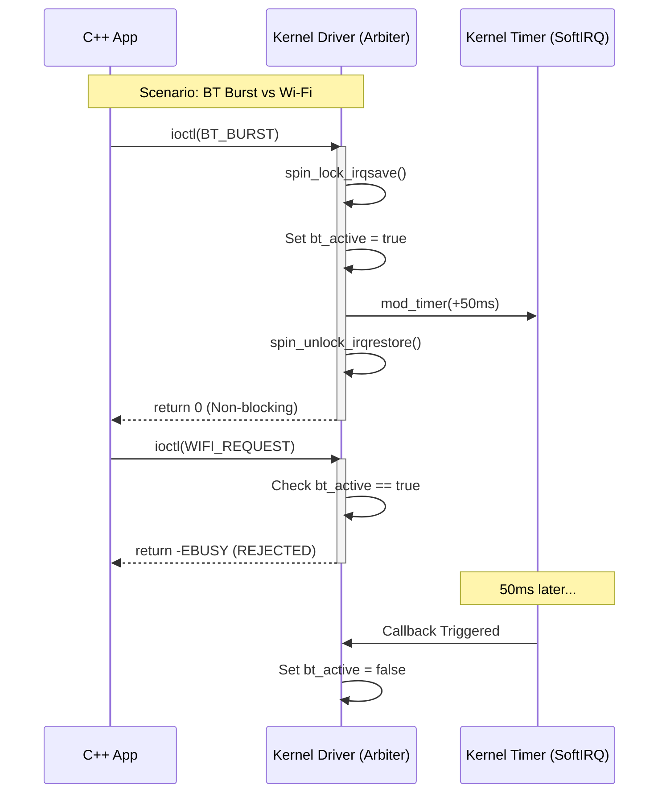

# Linux Virtual PTA (Packet Traffic Arbitration) Driver

## 📖 Project Overview
This project implements a **Linux Character Device Driver** to simulate the **Packet Traffic Arbitration (PTA)** mechanism used in wireless coexistence (Wi-Fi/Bluetooth) systems.

The goal is to demonstrate **Kernel Space programming**, **Concurrency Control**, and **Asynchronous Hardware Simulation** within a Linux environment. It mimics a real-world scenario where a Bluetooth transmission (high priority) must preempt a Wi-Fi request to avoid radio interference.

## 🚀 Key Features
* **Character Device Interface:** Implements `open`, `close`, and `ioctl` system calls for User/Kernel communication.
* **Concurrency Control:** Uses **Spinlocks (`spinlock_t`)** to protect critical sections and shared state variables against Race Conditions.
* **Arbitration Logic:** Enforces priority-based resource granting (Bluetooth > Wi-Fi) with rejection handling (`-EBUSY`).
* **Asynchronous Event Handling:** Utilizes **Kernel Timers (`struct timer_list`)** and **Jiffies** to simulate non-blocking hardware transmission bursts (SoftIRQ context).
* **User Space Tool:** A C++ CLI tool to interact with the driver and perform stress tests.

## 🛠️ Tech Stack
* **Language:** C (Kernel Module), C++ (User Space App)
* **Kernel APIs:** `linux/module.h`, `linux/fs.h`, `linux/spinlock.h`, `linux/timer.h`
* **Build System:** GNU Make (Kbuild)
* **Platform:** Linux (tested on Ubuntu 24.04, Kernel 6.8+)

## 🏗️ Architecture
The system consists of a User Space application sending requests via `ioctl`, and a Kernel Module acting as the Arbiter.



## ⚡ How to Build & Run

### 1. Build the Driver and App
```bash
make
g++ main.cpp -o pta_app
```

### 2. Load the Module
```bash
sudo insmod v_pta.ko
# If device node is not created automatically:
sudo mknod /dev/v_pta c 240 0
sudo chmod 666 /dev/v_pta
```

### 3. Test Scenarios
**Scenario A: BT Burst & Conflict**
```bash
./pta_app bt burst
./pta_app wifi 5
# Output: [REJECTED] Wi-Fi Request Denied! (BT is active)
```

**Scenario B: Check Stats**
```bash
./pta_app stats
```

## 👨‍💻 About Me
I am a Firmware Engineer specializing in Wi-Fi connectivity and embedded systems. This project was created to deepen my understanding of Linux Kernel internals and resource management in multi-core environments.